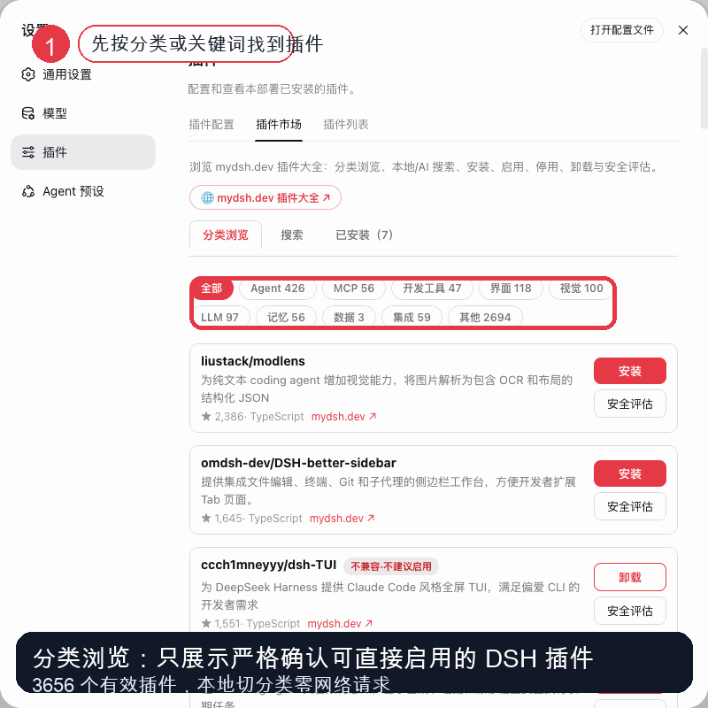
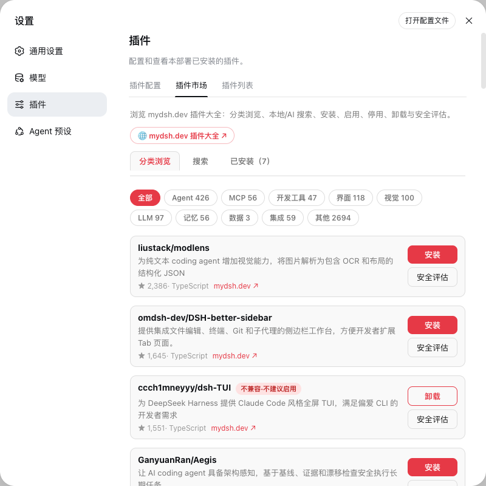
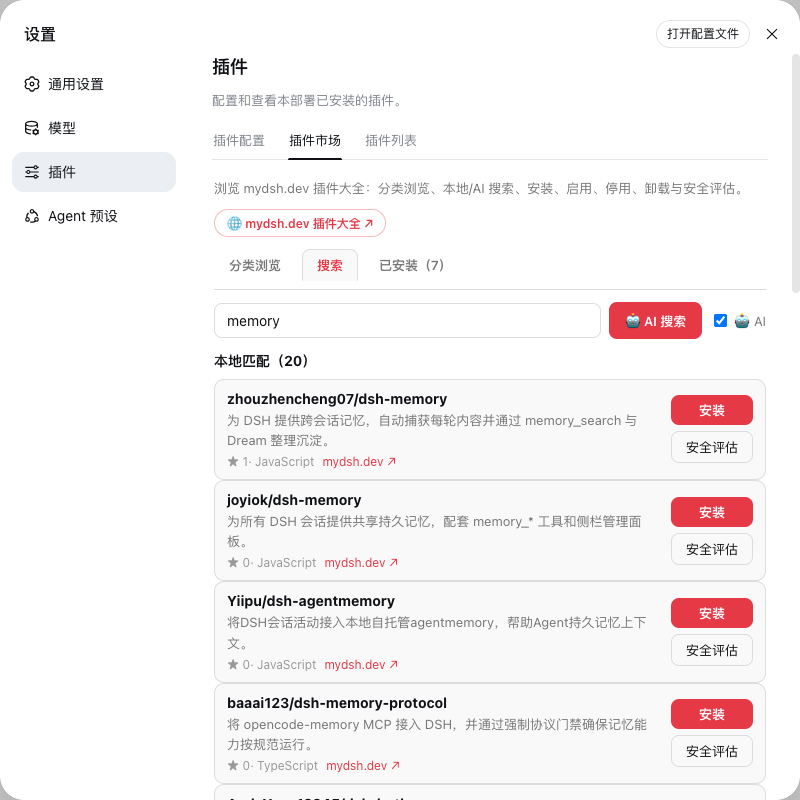
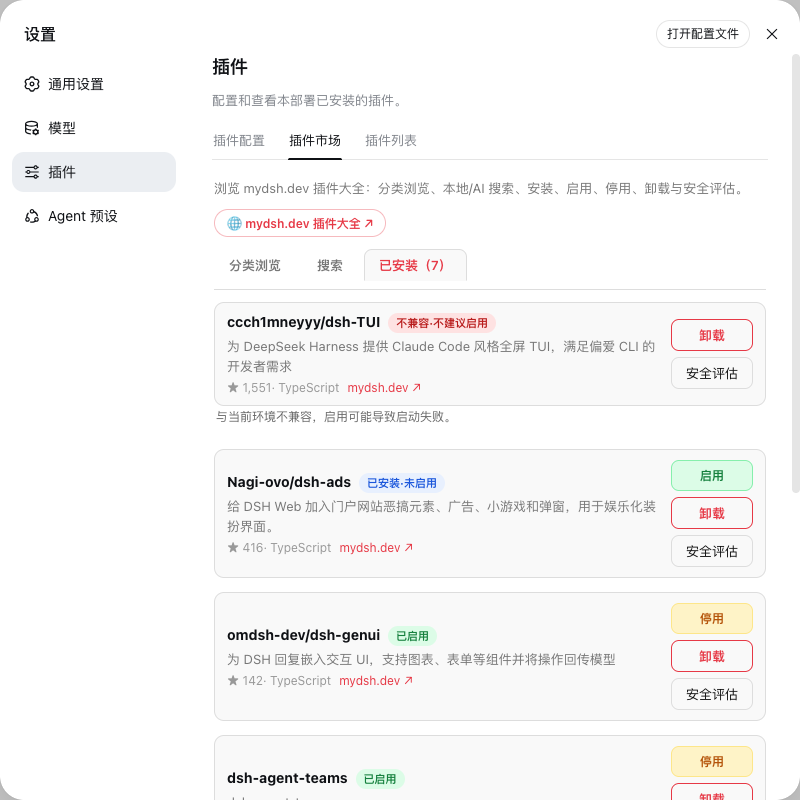

# dsh-plugin-market · 插件市场

在 DeepSeek Harness 设置页直接浏览 **mydsh.dev 插件大全**(catalog 5596 个,已核验可直接启用 **3656** 个)——分类浏览、本地/AI 搜索、安装、启用、停用、卸载、安全评估与**一键自动重启生效**。只展示已核验为可直接启用的 DSH 插件。非官方社区 mydsh.dev 出品。


<p align="center">
  
</p>

## 预览

| 分类浏览 | 本地 / AI 搜索 | 已安装状态 |
|---|---|---|
|  |  |  |

详细教程见：[docs/USAGE.zh-CN.md](docs/USAGE.zh-CN.md)。
软推广素材见：[docs/PROMOTION.zh-CN.md](docs/PROMOTION.zh-CN.md)。

## 功能

- **分类浏览**：全部 / Agent / MCP / 开发工具 / 界面 / 视觉 / LLM / 记忆 / 数据 / 集成 共 10 类，带计数，按星数排序，「加载更多」
- **本地搜索**：毫秒级本地匹配（名称 / 中英简介 / 描述 / topics）
- **AI 搜索**：勾选 🤖 AI 后调用 mydsh.dev 的 AI 搜索服务，语义理解你的需求
- **安装后可控启用**：安装只下载插件，不自动启用；是否启用由用户明确点击「启用」决定
- **启用 / 停用 / 卸载**：启用/停用后一键自动重启生效；停用保留安装，可随时重新启用；卸载彻底移除并清理启用状态
- **生命周期七态**：未安装 / 已安装·未启用 / 已启用·重启后生效 / 已启用 / 已停用·重启后生效 / 不兼容·不建议启用 / 安装失败
- **一键自动重启生效**：启用/停用后点「立即重启生效」——确认弹窗如实告知预估时长与影响，重启完成后页面自动刷新。适配所有运行环境（PM2 / 手动启动 / Docker / systemd / Windows）
- **安全评估**：查询 mydsh.dev 安全报告，无报告则引导提交
- **安全保护**：写配置前自动备份、写后校验、失败自动回滚；DSH 核心组件保护；不兼容插件拒绝启用（防启动失败）；安装失败留痕可重试；插件名白名单 + 同源校验 + 请求体上限
- **mydsh.dev 引流**：每个插件带详情页链接（README / 安装方式 / 相似推荐 / 中文总结）

## 性能

- 插件大全**磁盘持久化缓存**（`$DSH_HOME/storages/plugin_market_catalog.json`，6 小时 TTL）：重启不丢、不重复拉取 2MB 数据
- 严格校验缓存（`$DSH_HOME/storages/plugin_market_validated_bundle_v1.json`）：只把含 `dsh.bundle.patch` 声明的仓库标为可展示
- 分类切换**纯本地过滤**，零网络请求
- AI 搜索 6 秒超时保护，慢不阻塞本地结果

## 安装

```bash
# 方式一：从 GitHub 安装
dsh plugin --profile web add github:uluckystar/dsh-plugin-market

# 方式二：从本地目录安装（开发）
dsh plugin --profile web add /path/to/dsh-plugin-market
```

安装后重启 DSH，在 **设置 → 插件 → 插件市场** 查看。后续通过插件市场安装的插件需要先「启用」，再按提示重启 DSH 后生效。

## 配置（cordis.patch.yml）

```yaml
- id: plugin-market
  name: dsh-plugin-market
  config:
    marketBaseUrl: 'https://mydsh.dev'      # 数据源
    profileName: 'web'                       # 安装目标 profile
    pnpmCommand: 'npx -y pnpm@11.7.0'        # pnpm 版本（匹配 profile packageManager）
    proxyUrl: 'http://127.0.0.1:7897'        # 本机代理（加速 GitHub 下载），可置空
    catalogCacheMs: 21600000                 # 插件大全缓存 TTL（6 小时）
    installTimeoutMs: 300000                 # 安装超时
    githubToken: ''                          # 可选：GitHub API token；无 token 时使用 raw/HEAD + 代理校验
```

## API

| 端点 | 说明 |
|---|---|
| `POST /api/plugin-market/browse` | `{category, limit}` 分类浏览（limit=0 全量） |
| `POST /api/plugin-market/search` | `{query, ai}` 本地 + 可选 AI 搜索 |
| `POST /api/plugin-market/install` | `{repo}` 安装到当前配置，但不自动启用 |
| `POST /api/plugin-market/enable` | `{repo}` 启用插件，必要时提示重启 |
| `POST /api/plugin-market/disable` | `{repo}` 停用插件，保留安装 |
| `POST /api/plugin-market/uninstall` | `{repo}` 卸载并清理启用状态 |
| `POST /api/plugin-market/status` | `{repo}` 查看单个插件生命周期状态 |
| `POST /api/plugin-market/lifecycle` | 当前配置下全部已安装插件生命周期（含运行环境与自动重启能力） |
| `POST /api/plugin-market/restart` | 一键自动重启 DSH（PM2 托管由监督者拉起；其余环境由插件自拉起 wrapper） |
| `POST /api/plugin-market/assess` | `{repo}` 安全评估 |
| `POST /api/plugin-market/installed` | 已安装清单 |

## 数据源

[MyDSH · DeepSeek Harness 插件大全](https://mydsh.dev/plugins) —— 自动同步 DSH 插件候选（当前 5596 个），并通过 package.json 中的 `dsh.bundle.patch` 声明严格校验是否可直接启用（当前 3656 个有效 / 1940 个无效已隐藏）；插件市场只展示已严格确认的仓库。未知、不可解析、纯界面包和不完整包都不会展示。非官方社区。

## 开发

```bash
pnpm install
pnpm run typecheck   # host + client 双 tsc
pnpm run build       # tsc + tsdown（产物在 lib/）
node scripts/lifecycle-smoke.mjs   # 生命周期安全回归（18 项断言，临时 profile，不碰真实配置）
```

## License

MIT —— 详见 [LICENSE](./LICENSE)。

## 致谢

- [DeepSeek Harness](https://github.com/deepseek-ai/DeepSeek-Harness)——一切皆插件的 Agent 运行时
- [MyDSH 社区](https://mydsh.dev)——非官方插件大全数据源
